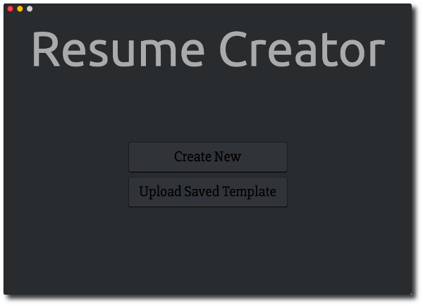

Resume Creator
==============

An application that lets you create your resume with ease and no headaches of formatting; written using Electron and <http://electron.atom.io/>.

<p align="center">
    
</p>

### Features
- TODO

Installation
------------
Install Node.js: <https://nodejs.org/en/>

```sh
# Install dependencies
$ npm install

# Install ResumeCreator (it will be installed in the /Applications directory where all your apps live)
$ npm run package-osx
```

NOTE: ResumeCreator.app is only tested on Mac OSX.

Future Improvements / New Features / Issues
-------------------------------------------
#### New Features (Future Improvements)
- TODO

#### Issues
- TODO

Author
------
Deep Aggarwal  
deep.uiuc@gmail.com  
Date Started: 01/09/2017  
